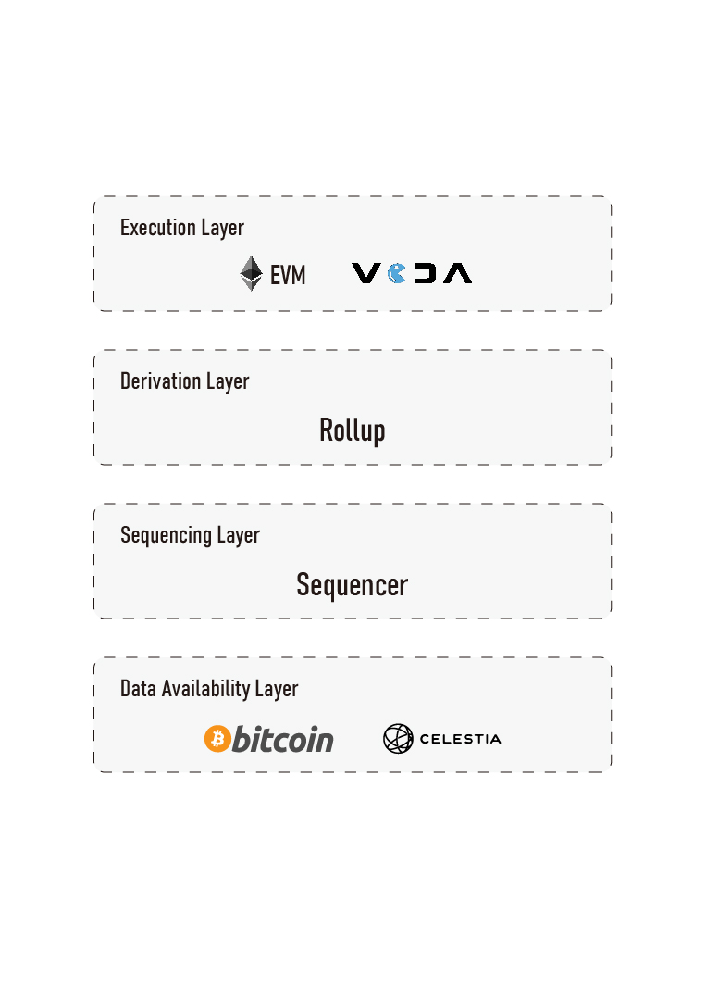

# Technical architecture

<figure><figcaption></figcaption></figure>

## Erde Superchain

The technical architecture of Erde Superchain is a horizontally scalable chain network, sharing security, communication layers, and an open-source development stack. The permissionless system for deploying new chains onto the shared network opens the doors to scaling large-scale, innovative applications, and new revenue models. It rewards application developers for the fees generated by their chains and incentivizes protocol developers for the public goods they create.

The Superchain is a network of L2 chains, called Erde Superchain, sharing security, communication layers, and an open-source technology stack. However, unlike a multi-chain design, these chains are standardized and intended to serve as interchangeable resources. This allows developers to build applications targeting the entire Superchain and abstract away the underlying chains on which applications run.

## Erde Chain

Erde Chain is a standalone chain within the Erde Superchain. All chains, regardless of their specific attributes, if formally managed by the Erde collective, are considered Erde Chains, and therefore part of the Superchain.

<figure><figcaption></figcaption></figure>

### Characteristics of Erde Superchain

* Shared L1: Provides a global / sequencing across all / transactions across all Erde Chains.
* Shared Bridges: Gives Erde Chains standardized security properties
* Cheap Deployment: Allows deploying and transacting on Erde Chains without paying high L1 transaction fees.
* Configuration Options: Allows Erde Chains to configure their Data Availability Provider, Sequencing Address , and so on.
* Secure Cross-Chain: Allows users to securely migrate state across Erde Chains

Users can create a chain within L2 by invoking the SystemConfig contract on L1. Once the chain data is on-chain, we can establish a Chain Factory to deploy configuration and all other necessary contracts for each chain. By utilizing `CREATE2` to determine contract addresses deterministically, all bridge addresses associated with the chain can be determined based on the chain configuration. This also enables interaction with the chain without deploying its bridge contracts, making (in retrospect) chain deployment almost cost-free and allowing the chain to inherit standard security features.
